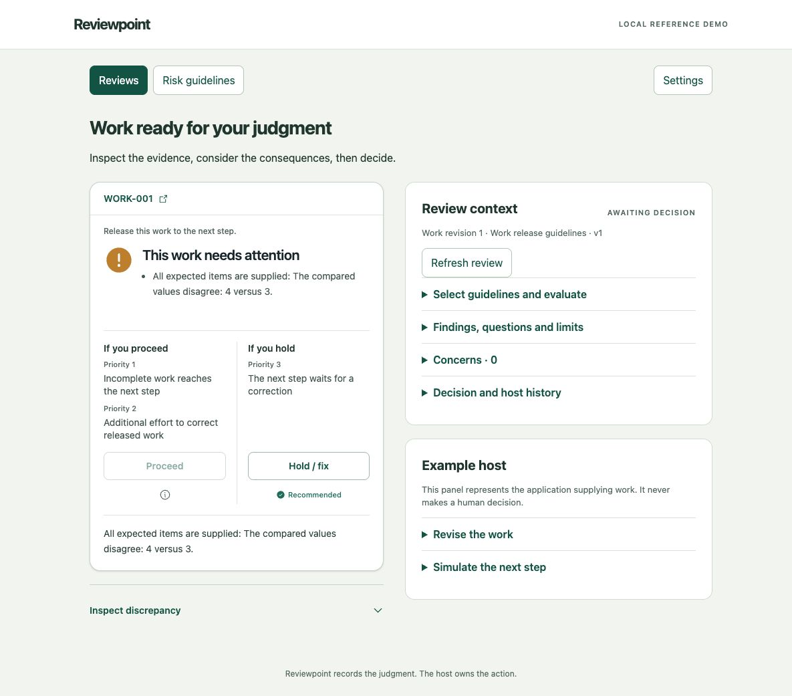

# Reviewpoint

**Risk guidelines, evidence-linked evaluation and explicit human decisions.**

Add a human review point before a host application takes a consequential action. Reviewpoint stores the submitted work and risk guidelines, evaluates the supplied material, records a person's decision and retains its history. The host owns work collection and execution.

This repository provides a local FastAPI/SQLite service and a small React/Tailwind/Vite reference UX. It includes one interactive, synthetic work review. The first run needs no model or API key.



## Run the demo

Requirements: Python 3.12 or 3.13 and [uv](https://docs.astral.sh/uv/getting-started/installation/). Run these commands from the repository root:

```bash
uv sync --locked
uv run --frozen --offline reviewpoint demo
```

Open **http://127.0.0.1:8767/**. The command identifies the private `.workspace/demo-credentials.json` file. Use its `owner` value in the sign-in form. Do not commit that file. Browser credentials stay in memory; reload/sign-out requires signing in again. Node is only needed when changing the frontend; built assets ship with the service.

The demo resumes its workspace on subsequent launches. It never overwrites decisions or adds another example. For a fresh walkthrough, choose a new workspace with `--workspace /path/to/new-workspace`.

1. Inspect **WORK-001**: three items are supplied, four are expected.
2. Choose **Hold / fix**, enter your reason and record Hold.
3. Open **Example host → Revise the work**, change supplied items to four and submit a revision.
4. Select guidelines and request an evaluation. Inspect the new recommendation.
5. Choose **Proceed**, enter your reason and record Proceed.
6. Open **Example host → Simulate the next step**. The host retrieves the current approval and reports a simulated handoff. No real action is performed.

Under **Risk guidelines**, edit consequences, priorities and requirements, then publish a version with a reason. Existing reviews keep their exact guideline version; request a new evaluation to apply changes.

## Read next

- [Concepts and service specification](docs/concepts.md): boundaries, records, authority and history.
- [Guideline guide](docs/guidelines.md): configure risks and requirements without writing JSON.
- [Integration guide](docs/integration.md): connect a host and replace simulated identity.
- [Development and operations](docs/development.md): checks, builds, backup and optional OpenAI setup.
- [Validation](docs/validation.md): demonstrated behavior and remaining work.

The server runs on loopback with one process and simulated external identity. Shared deployment, production authentication and distributed execution coordination are not implemented. A recommendation is advice; a saved decision is not proof that the host performed an action.

Licensed under [MIT](LICENSE). Copyright (c) 2026 Coharmony Corp, Inc / Sunrise AI. No hosted service or package publication is implied.
