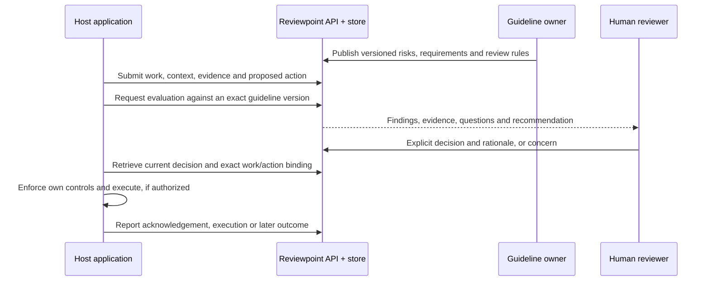

# Concepts and service specification

Reviewpoint is an add-on service at a host-defined commitment point. Inputs can describe any work; neither source code nor a particular version-control provider is required. The UI demonstrates the same API that hosts integrate.

## Ownership and flow

The host assembles evidence, chooses the checkpoint and performs any action. Reviewpoint evaluates only retained inputs. Profile owners define the consequences, requirements and review rules. Authorized humans decide and can challenge evidence, findings or guidelines. Identity comes from outside the service; project permissions determine authority.

## Records

| Record | Responsibility |
| --- | --- |
| Project and membership | Integration metadata and access for external actor IDs |
| Profile version | Scope, ordered risks, requirements, rules, owner and publication provenance |
| Case and submission | Host checkpoint identity and immutable revisions of proposed work, action and evidence |
| Assessment | Exact submission/profile binding, computed findings, references, recommendation, questions, limits and evaluation status |
| Decision | Explicit Yes/No, rationale, authenticated actor, authority, assessment binding and any permitted conditions/exceptions |
| Event | Concerns, responses, revisions, revocations, host reports and transactional history |

Eight SQLite tables implement these records: `projects`, `project_memberships`, `profile_versions`, `cases`, `submissions`, `assessments`, `decisions`, `events`. The [migration](../src/reviewpoint/migration.sql) is authoritative for a fresh database. Additional profile risk metadata resides in the existing JSON definition; no action-mapping table is necessary.

## Evaluation and risk

A **risk** describes a consequence; a **finding** describes an observation. A risk's `applies_to` value associates that consequence with Proceed, Hold or Both. This is an owner-authored association, not a calculated probability or a prediction that a consequence will occur.

Profile ordering directs presentation and emphasis. Reordering risks does not change deterministic requirement checks or silently waive a requirement. Requirements reference one or more risks, have applicability rules and use a versioned check method. Results distinguish `met`, `unmet`, `unknown` and `not_applicable`. Missing evidence, an unmet requirement and a failed evaluation are different states.

The finite check set is required values, equal values, record reconciliation, evidence binding and optional semantic interpretation. Interpretations must cite retained input; invalid references or malformed output fail evaluation. The model cannot fetch evidence, change policy, grant exceptions or approve actions. Input text is untrusted data. There is no paid call in the default example.

## Authority and history

A recommendation is separate from a human decision. The API requires an authenticated actor, current review token, exact assessment and a rationale. The UI starts with neither answer selected and requires a separate save. Requirements needing exceptions cannot be approved in the compact form, which does not collect exceptions; the API supports only explicitly permitted owner exceptions.

Submissions and profile versions are immutable. Revised work receives a fresh evaluation and cannot inherit approval. Publishing a profile does not modify old assessments. Reassessment, superseding decisions and revocation preserve previous records. Review tokens detect concurrent changes; mutation keys make retries idempotent. Concerns remain visible but do not silently revoke decisions or create requirements.

Host acknowledgement, reported execution and a saved decision are distinct events. Reports are host assertions, including late reports that no longer match current authorization. Traceability establishes what was recorded; it does not establish that the judgment was correct or make the database independently tamper-proof. Independent reviewers can expose incorrect findings or defective guidelines.
